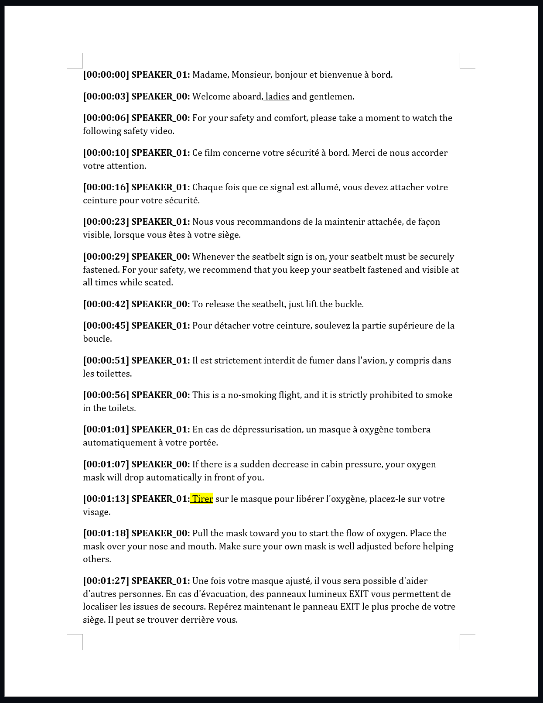

[](https://pypi.python.org/pypi/verbatim/)
[](https://pypi.org/project/verbatim/)
[](https://github.com/gaspardpetit/verbatim/actions/workflows/python-package.yml)
[](https://github.com/gaspardpetit/verbatim/actions/workflows/lint-security.yml)

# Verbatim

For high quality multilingual speech to text.

# Installation

## Prerequisites
- [Python](https://www.python.org/) version 3.9 to 3.11
- [Astral UV](https://github.com/astral-sh/uv) for development

### Portaudio

Portaudio is used on macOS and Linux for accessing the microphone when doing live transcription. To install:

Install on Linux:
```bash
 sudo apt install portaudio19-dev
```

Install on macOS:
```bash
 brew install portaudio
```

## Installing

Install from PyPI:
```
pip install verbatim
```

Install the latest from git:
```
pip install git+https://github.com/gaspardpetit/verbatim.git
```

### Torch with Cuda Support
If the tool falls back to CPU instead of GPU, you may need to reinstall the torch dependency with Cuda support. Refer to the following instructions: [https://pytorch.org/get-started/locally/](https://pytorch.org/get-started/locally/)

# HuggingFace Token
For diarization, this project requires access to the pyannote models which are gated:

1. Create an account on [Hugging Face](https://huggingface.co/)
2. Request access to the model at https://huggingface.co/pyannote/speaker-diarization-3.1
3. Request access to the model at https://huggingface.co/pyannote/segmentation-3.0
4. From your `Settings` > `Access Tokens`, generate an access token
5. When running verbatim for the first time, set the `HUGGINGFACE_TOKEN` environment variable to your Hugging Face token. Once the model is downloaded, this is no longer necessary. 

Instead of setting `HUGGINGFACE_TOKEN` environment variable, you may prefer to set the value using a `.env` file in the current directory like this:

## .env
```bash
HUGGINGFACE_TOKEN=hf_******
```

# Usage (from terminal)

Simple usage
```bash
verbatim audio_file.mp3
```

Verbose
```bash
verbatim audio_file.mp3 -v
```

Very Verbose
```bash
verbatim audio_file.mp3 -vv
```

Force CPU only
```bash
verbatim audio_file.mp3 --cpu
```

Save file in a specific directory
```bash
verbatim audio_file.mp3 -o ./output/
```

Start an HTTP server
```bash
verbatim --serve
```
This exposes a local `/audio/transcriptions` endpoint compatible with OpenAI's API.
Include `-F stream=true` in your request to receive Server-Sent Events (`transcript.text.delta`, `transcript.text.done`).

For see the [detailed terminal documentation](doc/verbatim-cli.md) for additional examples and options.

## Usage (from Docker)
The tool can also be used within a docker container. This can be particularly convenient, in the context where the audio and transcription is confidential, to ensure that the tool is completely offline since docker using `--network none`

With GPU support
```bash
docker run --network none --shm-size 8G --gpus all \
    -v "/local/path/to/out/:/data/out/" \
    -v "/local/path/to/audio.mp3:/data/audio.mp3" ghcr.io/gaspardpetit/verbatim:latest \
    verbatim /data/audio.mp3 -o /data/out --languages en fr
```

Without GPU support
```bash
docker run --network none \
    -v "/local/path/to/out/:/data/out/" \
    -v "/local/path/to/audio.mp3:/data/audio.mp3" ghcr.io/gaspardpetit/verbatim:latest \
    verbatim /data/audio.mp3 -o /data/out --languages en fr
```

## Usage (from python)

```python 
from verbatim import Context, Pipeline
context: Context = Context(
    languages=["en", "fr"],
    nb_speakers=2,
    source_file="audio.mp3",
    out_dir="out")
pipeline: Pipeline = Pipeline(context=context)
pipeline.execute()
```

The project is organized to be modular, such that individual components can be used outside the full pipeline, and the pipeline can be customized to use custom stages. For example, to use a custom diarization stage:

```python
from verbatim.audio.sources.sourceconfig import SourceConfig
from verbatim.audio.sources.factory import create_audio_source
source = create_audio_source(input_source="samples/Airfrance - Bienvenue à bord.wav", device="cuda", source_config=SourceConfig(diarize=2))

from verbatim.config import Config
from verbatim.verbatim import Verbatim
verbatim = Verbatim(config=Config(lang=["en", "fr"], output_dir="out"))

with source.open() as stream:
    for utterance, _unack_utterance, _unconfirmed_word in verbatim.transcribe(audio_stream=stream):
        print(utterance.text)
```

# Contributing

This project aims at finding the best implementation for each stage and glue them together. Contributions with new implementations are welcome.

Refer to the [build instructions](BUILD.md) to learn how to modify and test this project before submitting a pull request.

# Architecture
Refer to the [architecture details](doc/architecture.md) for further information on how Verbatim works.

# Objectives

## High Quality
Most design decisions in this project favour higher confidence over performance, including multiple passes in several parts to improve analysis. The main motivation for this project was to provide a robust transcription solution that would handle conversations in multiple languages. Most commercial and open-source solutions either expect the user to set the language to be used for the translation or will rely on a short audio sample (ex. the first 10-30 seconds) to detect the language and expect the entire conversation to remain in this language.

In most solution, a change in language during a conversation either results in gibberish or missing text.

By contrast, Verbatim will continuously test for language switching during the conversation. Although the primary focus was on multi-language support, it turns out that the iterative architecture that was developped for multi-language also provides improvements on single-language conversations. Utterances are considered in short segments and analyzed multiple time until Verbatim has built confidence that the text is accurate.

## Language support

Languages supported by [openai/whisper](https://github.com/openai/whisper) using the [whisper-large-v3](https://huggingface.co/openai/whisper-large-v3) model should also work, including: Afrikaans, Arabic, Armenian, Azerbaijani, Belarusian, Bosnian, Bulgarian, Catalan, Chinese, Croatian, Czech, Danish, Dutch, English, Estonian, Finnish, French, Galician, German, Greek, Hebrew, Hindi, Hungarian, Icelandic, Indonesian, Italian, Japanese, Kannada, Kazakh, Korean, Latvian, Lithuanian, Macedonian, Malay, Marathi, Maori, Nepali, Norwegian, Persian, Polish, Portuguese, Romanian, Russian, Serbian, Slovak, Slovenian, Spanish, Swahili, Swedish, Tagalog, Tamil, Thai, Turkish, Ukrainian, Urdu, Vietnamese, and Welsh

### Mixed language support
Speeches may comprise multiple languages. This includes different languages spoken one after the other (ex. two speakers alternating two languages) or multiple languages being mixed, such as the use of English expressions within a French speech.

### Speaker Identification
The speech recognition distinguishes between speakers using diarization based on  [pyannote](https://github.com/pyannote). 

### Word-Level Confidence
The output provides word-level confidence, with poorly recognized words clearly identified to guide manual editing.

### Time Tracking
The output text is associated with timestamps to facilitate source audio navigation when manually editing.

### Voice Isolation
Verbatim will work on unclean audio sources, for example where there might be music, keystrokes from keyboards, background noise, etc. Voices are isolated from other sounds using [adefossez/demucs](https://github.com/adefossez/demucs).

For audit purposes, the audio that was removed because it was considered *background* noise is saved so it can be manually reviewed if necessary.

### Optional GPU Acceleration (on a 12GB VRAM Budget)
The current objective is to limit the VRAM requirements to 12GB, allowing cards such as NVidia RTX 4070 to accelerate the processing.

Verbatim will also run on CPU, but processing should be expected to be slow.

### Long Audio Support (2h+)
The main use case for Verbatim is transcription of meeting. Consequently, it is designed to work with files containing at least 2 hours of audio.

### Audio Conversion
A variety of audio formats is support as input, including raw, compressed audio or even video files containing audio tracks. Any format supported by [ffmpeg](https://ffmpeg.org/) is accepted.

### Streaming
Verbatim can also be used with streaming audio. For this purpose, a low-latency mode can be enabled, at the cost of suboptimal quality.

### Offline processing
100% offline to ensure confidentiality. The docker image may be executed with `--network none` to ensure that nothing reaches out.

### Output designed for auditing
The output includes 
- a subtitle track rendered over the original audio to review the results.
- a Word document identifying low-confidence words, speaker and timestamps to quickly jump to relevant sections and ensure no part has been omitted

# Sample

Consider the following audio file obtained from [universal-soundbank](https://universal-soundbank.com/sounds/12374.mp3) including a mixture of French and English:


https://github.com/gaspardpetit/verbatim/assets/9883156/23bc86d2-567e-4be3-8d79-ba625be8c614


First, we extract the background audio and remove it from the analysis:

**Background noise:**

https://github.com/gaspardpetit/verbatim/assets/9883156/42fad911-3c15-45c2-a40a-7f923fdd4533

Then we perform diarization and language detection. We correctly detect one speaker speaking in French and another one speaking in English:

**Speaker 0 | English:**

https://github.com/gaspardpetit/verbatim/assets/9883156/cecec5aa-cb09-473e-bf9b-c5fd82352dab

**Speaker 1 | French:**

https://github.com/gaspardpetit/verbatim/assets/9883156/8074c064-f4d2-4ec4-8fc0-c985f7c276e8

The output consists of a Word document highlighting words with low certainty (low certainty are underlined and highlighted in yellow, while medium certainty are simply underlined):



A subtitle file is also provided and can be attached to the original audio:

https://github.com/gaspardpetit/verbatim/assets/9883156/9bcc2553-f183-4def-a9c4-bb0c337d4c82

A direct use of whisper on an audio clip like this one results in many errors. Several utterances end up being translated instead of being transcribed, and others are simply unrecognized and missing:

<table>
  <tr>
    <th></th>
    <th><b>Naive Whisper Transcription</b></th>
    <th><b>Verbatim Transcription</b></th>
  </tr>

  <tr>
    <td>✅</td>
    <td>Madame, Monsieur, bonjour et bienvenue à bord.</td>
    <td>Madame, Monsieur, bonjour et bienvenue à bord.</td>
  </tr>

  <tr>
    <td>❌</td>
    <td>Bienvenue à bord, Mesdames et Messieurs.</td>
    <td>Welcome aboard, ladies and gentlemen.</td>
  </tr>

  <tr>
    <td>❌</td>
    <td>Pour votre sécurité et votre confort, prenez un moment pour regarder la
        vidéo de sécurité suivante.</td>
    <td>For your safety and comfort, please take a moment to watch the following safety video.</td>
  </tr>

  <tr>
    <td>✅</td>
    <td>Ce film concerne votre sécurité à bord. Merci de nous accorder votre attention.</td>
    <td>Ce film concerne votre sécurité à bord. Merci de nous accorder votre attention.</td>
  </tr>

  <tr>
    <td>✅</td>
    <td>Chaque fois que ce signal est allumé, vous devez attacher votre ceinture pour votre sécurité.</td>
    <td>Chaque fois que ce signal est allumé, vous devez attacher votre ceinture pour votre sécurité.</td>
  </tr>

  <tr>
    <td>✅</td>
    <td>Nous vous recommandons de la maintenir attachée de façon visible lorsque vous êtes à votre siège.</td>
    <td>Nous vous recommandons de la maintenir attachée, de façon visible, lorsque vous êtes à votre siège.</td>
  </tr>

  <tr>
    <td>❌</td>
    <td>Lorsque le signe de la selle est en place, votre selle doit être assise
        en sécurité. Pour votre sécurité, nous
        recommandons que vous gardiez votre selle assise et visible à tous les temps en selle.</td>
    <td>Whenever the seatbelt sign is on, your seatbelt must be securely fastened. For your safety, we recommend that
      you keep your seatbelt fastened and visible at all times while seated.</td>
  </tr>

  <tr>
    <td>❌</td>
    <td>Pour détacher votre selleure, soulevez la partie supérieure de la boucle.</td>
    <td>To release the seatbelt, just lift the buckle.</td>
  </tr>

  <tr>
    <td>❌</td>
    <td></td>
    <td>Pour détacher votre ceinture, soulevez la partie supérieure de la boucle.</td>
  </tr>

  <tr>
    <td>✅</td>
    <td>Il est strictement interdit de fumer dans l'avion, y compris dans les toilettes.</td>
    <td>Il est strictement interdit de fumer dans l'avion, y compris dans les toilettes.</td>
  </tr>

  <tr>
    <td>❌</td>
    <td></td>
    <td>This is a no-smoking flight, and it is strictly prohibited to smoke in the toilets.</td>
  </tr>

  <tr>
    <td>✅</td>
    <td>En cas de dépressurisation, un masque à oxygène tombera automatiquement à votre portée.</td>
    <td>En cas de dépressurisation, un masque à oxygène tombera automatiquement à votre portée.</td>
  </tr>

  <tr>
    <td>❌</td>
    <td></td>
    <td>If there is a sudden decrease in cabin pressure, your oxygen mask will drop automatically in front of you.</td>
  </tr>

  <tr>
    <td>✅</td>
    <td>Tirez sur le masque pour libérer l'oxygène, placez-le sur votre visage.</td>
    <td>Tirer sur le masque pour libérer l'oxygène, placez-le sur votre visage.</td>
  </tr>

  <tr>
    <td>❌</td>
    <td></td>
    <td>Pull the mask toward you to start the flow of oxygen. Place the mask over your nose and mouth. Make sure your
      own mask is well-adjusted before helping others.</td>
  </tr>

  <tr>
    <td>✅</td>
    <td>Une fois votre masque ajusté, il vous sera possible d'aider d'autres personnes. En cas d'évacuation, des
      panneaux lumineux EXIT vous permettent de localiser les issues de secours. Repérez maintenant le panneau EXIT le
      plus proche de votre siège. Il peut se trouver derrière vous.</td>
    <td>Une fois votre masque ajusté, il vous sera possible d'aider d'autres personnes. En cas d'évacuation, des
      panneaux lumineux EXIT vous permettent de localiser les issues de secours. Repérez maintenant le panneau EXIT le
      plus proche de votre siège. Il peut se trouver derrière vous.</td>
  </tr>

  <tr>
    <td>❌</td>
    <td>En cas d'urgence, les signes d'exit illuminés vous aideront à locater
        les portes d'exit.</td>
    <td>In case of an emergency, the illuminated exit signs will help you locate the exit doors.</td>
  </tr>

  <tr>
    <td>❌</td>
    <td>S'il vous plaît, prenez un moment pour locater l'exit le plus proche de
        vous. L'exit le plus proche peut être
        derrière vous.</td>
    <td>Please take a moment now to locate the exit nearest you. The nearest exit may be behind you.</td>
  </tr>

  <tr>
    <td>❌</td>
    <td>Les issues de secours sont situées de chaque côté de la cabine, à l'avant, au centre, à l'arrière. <span
        style="background-color: yellow;">à l'avant, au
        centre, à l'arrière.</span></td>
    <td>Les issues de secours sont situées de chaque côté de la cabine, à l'avant, au centre, à l'arrière.</td>
  </tr>

  <tr>
    <td>❌</td>
    <td></td>
    <td>Emergency exits on each side of the cabin are located at the front, in the center, and at the rear.</td>
  </tr>

  <tr>
    <td>✅</td>
    <td>Pour évacuer l'avion, suivez le marquage lumineux.</td>
    <td>Pour évacuer l'avion, suivez le marquage lumineux.</td>
  </tr>

  <tr>
    <td>❌</td>
    <td></td>
    <td>In the event of an evacuation, pathway lighting on the floor will guide you to the exits.</td>
  </tr>

  <tr>
    <td>✅</td>
    <td>Les portes seront ouvertes par l'équipage.</td>
    <td>Les portes seront ouvertes par l'équipage.</td>
  </tr>

  <tr>
    <td>❌</td>
    <td></td>
    <td>Doors will be opened by the cabin crew.</td>
  </tr>

  <tr>
    <td>✅</td>
    <td>Les toboggans se déploient automatiquement.</td>
    <td>Les toboggans se déploient automatiquement.</td>
  </tr>

  <tr>
    <td>❌</td>
    <td></td>
    <td>The emergency slides will automatically inflate.</td>
  </tr>

  <tr>
    <td>✅</td>
    <td>Le gilet de sauvetage est situé sous votre siège ou dans la coudoir centrale.</td>
    <td>Le gilet de sauvetage est situé sous votre siège ou dans l'accoudoir central.</td>
  </tr>

  <tr>
    <td>❌</td>
    <td></td>
    <td>Your life jacket is under your seat or in the central armrest.</td>
  </tr>

  <tr>
    <td>✅</td>
    <td>Passez la tête dans l'encolure, attachez et serrez les sangles.</td>
    <td>Passez la tête dans l'encolure, attachez et serrez les sangles.</td>
  </tr>

  <tr>
    <td>❌</td>
    <td></td>
    <td>Place it over your head and pull the straps tightly around your waist. Inflate your life jacket by pulling the
      red toggles.</td>
  </tr>

  <tr>
    <td>✅</td>
    <td>Une fois à l'extérieur de l'avion, gonflez votre gilet en tirant sur les poignées rouges.</td>
    <td>Une fois à l'extérieur de l'avion, gonflez votre gilet en tirant sur les poignées rouges.</td>
  </tr>

  <tr>
    <td>❌</td>
    <td>Faites-le seulement quand vous êtes à l'extérieur de l'avion.
    </td>
    <td>Do this only when you are outside the aircraft.</td>
  </tr>

  <tr>
    <td>✅</td>
    <td>Nous allons bientôt décoller. La tablette doit être rangée et votre dossier redressé.</td>
    <td>Nous allons bientôt décoller. La tablette doit être rangée et votre dossier redressé.</td>
  </tr>

  <tr>
    <td>❌</td>
    <td></td>
    <td>In preparation for takeoff, please make sure your tray table is stowed and secure and that your seat back is in
      the upright position.</td>
  </tr>

  <tr>
    <td>✅</td>
    <td>L'usage des appareils électroniques est interite pendant le décollage et l'atterrissage.</td>
    <td>L'usage des appareils électroniques est interdit pendant le décollage et l'atterrissage.</td>
  </tr>

  <tr>
    <td>❌</td>
    <td></td>
    <td>The use of electronic devices is prohibited during takeoff and landing.</td>
  </tr>

  <tr>
    <td>✅</td>
    <td>Les téléphones portables doivent rester éteints pendant tout le vol.</td>
    <td>Les téléphones portables doivent rester éteints pendant tout le vol.</td>
  </tr>

  <tr>
    <td>❌</td>
    <td></td>
    <td>Mobile phones must remain switched off for the duration of the flight.</td>
  </tr>

  <tr>
    <td>✅</td>
    <td>Une notice de sécurité placée devant vous est à votre disposition.</td>
    <td>Une notice de sécurité placée devant vous est à votre disposition.</td>
  </tr>

  <tr>
    <td>❌</td>
    <td>Merci encourage everyone to read the safety information leaflet located
        in the seat back pocket.</td>
    <td>We encourage everyone to read the safety information leaflet located in the seat back pocket.</td>
  </tr>

  <tr>
    <td>✅</td>
    <td>Merci pour votre attention. Nous vous souhaitons un bon vol.</td>
    <td>Merci pour votre attention. Nous vous souhaitons un bon vol.</td>
  </tr>

  <tr>
    <td>✅</td>
    <td>Thank you for your attention. We wish you a very pleasant flight.
    <td>Thank you for your attention. We wish you a very pleasant flight.</td>
  </tr>
</table>
## Model Cache and Offline Mode

Verbatim can prefetch and reuse models from a deterministic cache directory, and can run 100% offline once the cache is warmed.

- `--model-cache <dir>`: sets a shared cache directory used by Hugging Face, Whisper, and faster-whisper.
- `--offline`: prevents any network access and model downloads. All models must already be present in the cache; otherwise a clear error is raised.
- `--install`: prefetches commonly used models into the selected cache and exits.

Examples

1) Prefetch models (first run, with network):
```
HUGGINGFACE_TOKEN=hf_... verbatim --install --model-cache /models
```

2) Fully offline run reusing the cache:
```
verbatim input.mp3 -o out --model-cache /models --offline
```

Default cache location (when `--model-cache` is not specified):
- Local project directory `./.verbatim/` is used as the root cache.
- Subdirectories are created inside: `./.verbatim/hf`, `./.verbatim/whisper`, etc.
- If `./.verbatim/` cannot be created or is not writable, the app gracefully falls back to library defaults.

Voice isolation (MDX): the `audio-separator` backend loads a checkpoint (e.g., `MDX23C-8KFFT-InstVoc_HQ_2.ckpt`).
For offline use with `--model-cache`, place the file under `<cache>/audio-separator/`.
